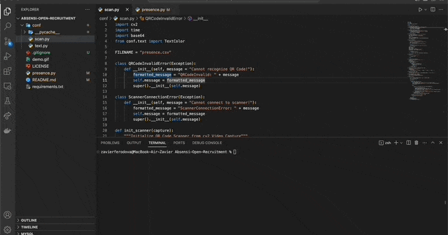

# Absensi Open Recruitment
Sistem absensi untuk open recruitment Fosti UMS

### Recommended using Python 3

- IP camera Support (You can use Droid cam or similiar)

### Install with git

From the command line, switch to the directory where absensi will reside and run
the following commands:

```sh
git clone https://github.com/fosti/Absensi-Open-Recruitment.git
cd Absensi-Open-Recruitment
```


### How to use it

From the command line, switch to the directory where absensi cloned:

```sh
cd Absensi-Open-Recruitment
python3 run.py
```

> Demo



